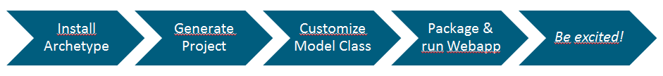
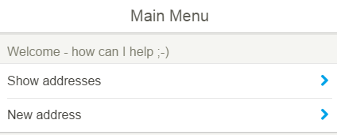
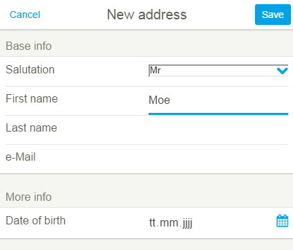
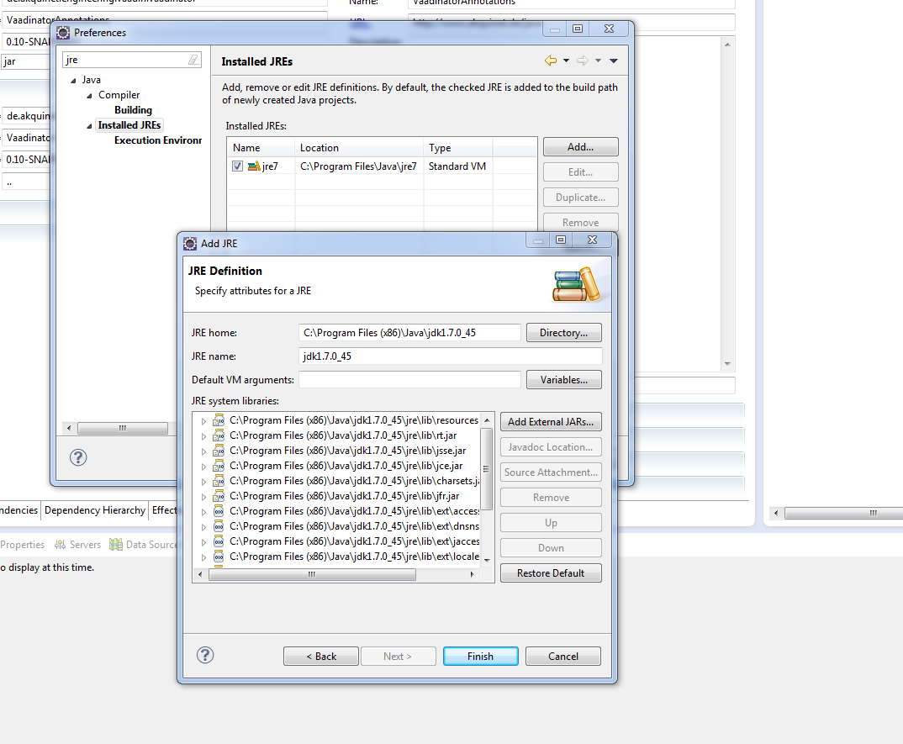
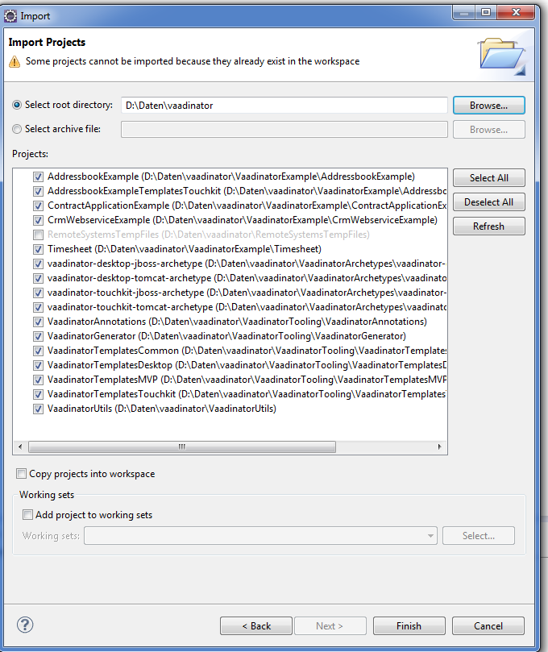
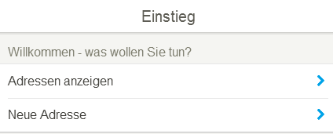
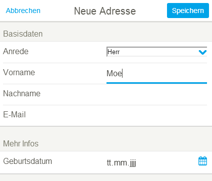

Vaadinator
==========

<a href="#start-en">English</a> - <a href="#start-de">Deutsch</a>

<hr />

<a name="start-en" />

## What is Vaadinator?

Vaadinator generates a [vaadin](http://www.vaadin.com)-based User Interface (both mobile and Desktop), backend and testing facilties from an annotated Domain class. It borrows much from the Domain Driven Design idea (see e.g. Eric Evan's classic <i>Domain Driven Design - tackling complexity in the heart of software</i>, Addison-Wesley, 2004) where the domain object is the cornerstone of analysis, design and also implementation activity.

Above all, however, Vaadinator is aimed to get you started with vaadin in a way that is both <strong>fast</strong> and <strong>well-designed</strong>. Hence, Vaadinator does not only generate code for you, it also
- applies Model-View-Presenter (MVP) throughout the application - giving it a clear structure and providing a good basis to build upon
- makes sure the logic of an application is testable - both in the UI (through MVP) and in the service layer
- makes sure the application is split into well-defined parts and stays manageable
- provides a solid basis for acceptance testing (Acceptance-Test Driven Development - ATDD) leveraging [Testeditor](http://testeditor.org) - copy the generated artifacts to testeditor and get your domain experts productive writing meaningful acceptance tests.
- provides Archetypes for a quickstart within minutes

Our intention is to get people productive with vaadin and excited about vaadin - even those who never worked with it before.

## Quick guide to get started NOW



- have [Maven](http://maven.apache.org) and [Tomcat](http://tomcat.apache.org) in place (optionally also Eclipse)
 
- download + unpack or clone project
- open command prompt:
```
cd <checkoutDir>
mvn install
cd ../<yourEmptyDir>
mvn archetype:generate -DarchetypeGroupId=de.akquinet.engineering.vaadin.vaadinator -DarchetypeArtifactId=vaadinator-touchkit-tomcat-archetype -DarchetypeVersion=0.10-SNAPSHOT
```
- when specifying groupId, artifactId and package make sure not to use special characters - particularly not the minus sign "-" to avoid trouble
- the sample class (and thus the generation result) is German - if you want to see an English UI instead download this <a href="misc/messages_en.properties">messages_en.properties</a> and store it to src/main/resources/<i>packageChosenBefore</i>/ui/std/view/messages_en.properties
```
cd <artifactId>
mvn package eclipse:eclipse
```
- eclipse:eclipse is only necessary if you want to open in Eclipse (make sure you have UTF-8 configured as workspace default charset)
- copy WAR to Tomcat or open in Eclipse and <i>Run on Server</i>
- you will get a <strong>mobile</strong> base application that runs in the browser
- open with iPhone or Chrome or other Webkit-based browser

Result - Start:


Result - after tapping "New Address":
  

(everyone with a little more patience pls. read on)

## How does Vaadinator work, exactly?

Vaadinator leverages [Maven](http://maven.apache.org) by adding a generator to the build process: during the <i>generate-sources</i> and <i>generate-resources</i> phases of Maven, the Vaadinator plugin ("Mojo" in Maven-lingo) reads your domain classes, especially the Annotations provided within them, and generates some more Java code based on that. The generation process can be executed any number of times as your domain class changes (unlike scaffolding that [Ruby on Rails](http://rubyonrails.org), [Grails](http://grails.org), etc. use) and the generation result is code to be inherited (unlike the runtime approach that e.g. [Isis](http://isis.apache.org) uses). Furthermore, mobile development (using vaadin TouchKit) comes right out of the box.

For a first look at your vaadin application, executing the Maven build is already enough. You can fire up the application in a Tomcat and check out the result. Naturally, you'll soon want to customize and extend what you see. You can do that by customizing the domain class and (as soon as this is no more sufficient) by extending any of the generated Presenter / View classes (you could even copy over the generated code if you get tired of the generator - but we hope you'll never be). 

To get you started quickly, you can set up a new project by using an Archetype (see next Chapter for details).
 
## How do I get started?

First of all, you should have the following in place:
- [Maven](http://maven.apache.org)
- [Tomcat](http://tomcat.apache.org)
- optional: [JBoss](http://www.jboss.org) application server
- optional: [PostgreSQL](http://postgresql.org) (or a database of your choice)
- optional: [Eclipse](http://www.eclipse.org) (or any IDE)
- optional: [Testeditor](http://testeditor.org)

First of all, download and install Vaadinator from github either by cloning or downloading the ZIP. On the topmost project run
```
mvn install
```

As a result of that, Vaadinator's Archetypes are available through the local Maven repository. In order to get started open a command prompt (with Maven installed) and type:
```
mvn archetype:generate -DarchetypeGroupId=de.akquinet.engineering.vaadin.vaadinator -DarchetypeArtifactId=vaadinator-touchkit-tomcat-archetype -DarchetypeVersion=0.10-SNAPSHOT
```
Maven will then prompt you for a groupId, an artifactId and a version for your new project. As soon as you have provided and confirmed these, you have a project in place (in the current working directory). 

The project is very lean, it only consists of a few files: 
- src/main/java/<i>package</i>/model/Address.java (et al): an address class which is the sample model class (see below)
- src/main/java/<i>package</i>/MobileWidgetset.gwt.xml: widgetset for vaadin TouchKit
- src/main/resources/META-INF/persistence.xml: provides a persistence config to use
- src/test/resources/META-INF/persistence.xml: provides an in-memory database configuration you can use to test services with (if you choose not to: forget about this file)
- src/main/webapp/beans.xml+web.xml: base files for JEE
- src/main/webapp/context.xml (only for Tomcat): wires up your data source

The address class contains Annotations (coming from VaadinatorAnnotations - plus those for persistence aka JPA) to define how the UI should be built (abbreviated):
```java
@DisplayBean(captionText = "Adresse")
@Entity
public class Address implements Serializable {

	/**
	 * 
	 */
	private static final long serialVersionUID = 1L;

	public Address() {
		super();
	}

	@Id
	@GeneratedValue(strategy = GenerationType.IDENTITY)
	private long id;
	@DisplayProperty(profileSettings = { @DisplayPropertySetting(fieldType = FieldType.DROPDOWN) }, captionText = "Anrede")
	private Anreden anrede;
	@DisplayProperty
	private String vorname;
	
	@DisplayProperty(profileSettings = { @DisplayPropertySetting(showInTable = true, showInDetail = false) })
	public String getName() {
		return getVorname() + " " + getNachname();
	}
}
```

Which has the following meaning in detail: 
- @DisplayBean(captionText = "Adresse") => the class has a custom caption (used for buttons, etc.)
- id is not displayed (as there is no @DisplayProperty anywhere)
- @DisplayProperty(profileSettings = { @DisplayPropertySetting(fieldType = FieldType.DROPDOWN) } ... => anreden (salutations) is displayed as dropdown 
- ..., captionText = "Anrede") => with a custom caption as well
- @DisplayProperty => vorname (first name) is displayed (with defaults)
- the Annotations can be both applied to properties and getters / setters (any way, getters / setters will be invoked) 
- @DisplayProperty(profileSettings = { @DisplayPropertySetting(showInTable = true, showInDetail = false) }) => here we have a generated property (available via getter only), and it's only shown in the table, not in details

You can customize (and also rename) this class in any way: add new attributes, change input types - check out what is possible! (When renaming: remember persistence.xml!)

You can now compile the project and make it ready for [Eclipse](http://www.eclipse.org) via
```
mvn package eclipse:eclipse
```
(off course, you can use your favorite IDE or none at all). The widgetset compilation for mobile is started automatically - details on that can also be found in the [Book of Vaadin](http://vaadin.com/book).

For Tomcat an internal database is used as default (no further action required). For JBoss (and as an option for Tomcat also) the application assumes a [PostgreSQL](http://postgresql.org) database in place with the table from <i>create-tables.sql</i> in it (the same SQL will also be generated by the framework used - i.e. [EclipseLink](http://www.eclipse.org/eclipselink/)). See the details section below on how to configure external data sources. 

You can now fire up Tomcat and check out your vaadin application!

If you don't want Tomcat and mobile (aka vaadin TouchKit) - the <i>vaadinator-touchkit-tomcat-archetype</i> - you can also check out these Archetypes:
- <i>vaadinator-desktop-tomcat-archetype</i>: Desktop on Tomcat, uses an internal H2 database until you specify otherwise (see below)
- <i>vaadinator-touchkit-jboss-archetype</i>: Touchkit on JBoss, needs an external data source in place (see below)
- <i>vaadinator-desktop-jboss-archetype</i>: Desktop on JBoss, needs an external data source in place (see below)

Pls. observe that some TouchKit elements might behave better on actual smartphones than on a desktop browser.

You can also start customizing the domain model classes and check out the results.

## How 2 move on? - fill me in on the details!

### Start working with vaadinator and eclipse (without m2eclipse)

open eclipse with workspace vaadinator

check installed jre (Preferences -> installed JRE 
a jdk is needed: 

on command prompt, go to project directory (cd vaadinator)
```
execute mvn eclipse:eclipse (it works, if mvn install in step1 was executed)
```

go to the subprojects of VaadinatorExample, for each execute mvn eclipse:eclipse 

in eclipse with the workspace selected before

right mouse in Project Explorer -> import -> Existing Projects into Workspace -> choose vaadinator 

import all selected projects:




### Using an external data source

Beyond initial testing, it will make sense to configure a data source for the sake of stability and performance. Here is how you can do that for the project you generated with Vaadinator (and also for the examples coming with Vaadinator):

When using the [Tomcat](http://tomcat.apache.org) server, persistence.xml must be changed (delete upper part, uncomment lower part) to use an external data source. Plus the data source must be known to Tomcat by adding the following to <i>conf/context.xml</i>:
```
<Resource name="jdbc/vaadin" auth="Container" type="javax.sql.DataSource" maxActive="100" maxIdle="30" maxWait="10000" username="vaadin" password="whateverpwyouhave" driverClassName="org.postgresql.Driver" url="jdbc:postgresql://localhost:5432/vaadin"/>
```
(customize the settings according to your database). The driver must be in Tomcat's lib directory. 

When using [JBoss](http://www.jboss.org) application server, the data source must be known to the application server by adding it to <i>standalone/configuration/standalone.xml</i> in the <i>datasources</i> subsystem like this:
```
<subsystem xmlns="urn:jboss:domain:datasources:1.0">
  <datasources>
    <!-- you might have some data sources already -->
    <datasource jta="true" jndi-name="java:/jdbc/vaadin" pool-name="vaadin" enabled="true" use-java-context="true" use-ccm="false">
      <connection-url>jdbc:postgresql://localhost:5432/vaadin</connection-url>
      <driver-class>org.postgresql.Driver</driver-class>
      <driver>postgresql</driver>
      <pool>
        <min-pool-size>8</min-pool-size>
        <max-pool-size>800</max-pool-size>
      </pool>
      <security>
        <user-name>vaadin</user-name>
        <password>whateverpwyouhave</password>
      </security>
    </datasource>
  </datasources>
  <drivers>
    <!-- you might have some drivers already -->
    <driver name="postgresql" module="org.postgresql">
      <xa-datasource-class>org.postgresql.xa.PGXADataSource</xa-datasource-class>
    </driver>
  </drivers>
</subsystem>
```
(customize the settings according to your database). The driver must be available as a module - in our case be placed into <i>modules/org/postgresql/main</i> along with the following module.xml:
```
<?xml version="1.0" encoding="UTF-8"?>  
<module xmlns="urn:jboss:module:1.0" name="org.postgresql">  
  <resources>  
    <resource-root path="postgresql-9.1-901.jdbc4.jar"/>  
  </resources>  
  <dependencies>  
    <module name="javax.api"/>  
    <module name="javax.transaction.api"/>  
  </dependencies>  
</module>
```

You can use Maven to download the driver also - for PostgreSQL the command would be:
```
mvn dependency:get -DgroupId=postgresql -DartifactId=postgresql -Dversion=9.1-901.jdbc4 -DrepoUrl=http://repo1.maven.org/maven2/ -Dtransitive=false
```
(the JAR will be placed into the local Maven repository aka M2_REPO and you can copy it from there)

### MVP structure of the UI

You'll have recognized that for each model class, the following structure is created: 
- <i>basepackage</i>.ui.std.presenter.<i>Class</i>AddPresenter
- <i>basepackage</i>.ui.std.presenter.<i>Class</i>AddPresenterImpl
- <i>basepackage</i>.ui.std.presenter.<i>Class</i>ChangePresenter
- <i>basepackage</i>.ui.std.presenter.<i>Class</i>ChangePresenterImpl
- (and so forth)
- <i>basepackage</i>.ui.std.view.<i>Class</i>AddView
- <i>basepackage</i>.ui.std.view.<i>Class</i>AddViewImpl
- <i>basepackage</i>.ui.std.view.<i>Class</i>ChangeView
- <i>basepackage</i>.ui.std.view.<i>Class</i>ChangeViewPresenterImpl
- (and so forth)

together with the <strong>M</strong>odel class, <strong>V</strong>iew and <strong>P</strong>resenter make up an <strong>MVP</strong> (= Model-View-Presenter) structure. Following this structure provides several advantages for your development effort: 
- you can test logic in a very straightforward (and easy) way. This will also make it more likely that logic is tested at all ;-)
- the logic embedded in presenters is very likely to be re-usable (and also compose-able - i.e. you can nest presenters and views for complex UIs)
- your application is very likely to have a coherent structure (all Presenters inherit an interface, there is a clear package structure, etc.)

For instance, the add presenter (that derives common features from the abstract edit presenter) looks as follows (abbreviated):
```java
public class AddressAddPresenterImpl extends AddressEditPresenterImpl
		implements AddressAddPresenter, AddressAddView.Observer {

	/**
	 * 
	 */
	private static final long serialVersionUID = 1L;
     
	private AddressAddView view;
	private Presenter returnPresenter =null;
	private AddressService service;

	public AddressAddPresenterImpl(AddressAddView view, Presenter returnPresenter, AddressService service) {
		super(view, returnPresenter);
		this.view = view;
		this.returnPresenter = returnPresenter;
		this.service = service;
	}
	
	@Override
	public AddressAddView getView() {
		return view;
	}
	
	@Override
	public void startPresenting() {
		// reset object
		setAddress(new Address());
		view.setObserver(this);
		super.startPresenting();
	}
	
	@Override
	public void onSave() {
		// eigene Impl! (wg. add)
		if (!view.checkAllFieldsValid()) {
			return;
		}
		saveToModel();
		try {
			this.service.addNewAddress(getAddress(), new HashMap<String, Object>());
		} catch (RuntimeException exc) {
			view.showErrorMessage(exc.toString());
			throw exc;
		}
		if (returnPresenter != null) {
			returnPresenter.returnToThisPresener(this);
		}
	}
}
```

Here is a simple example of how to test this presenter (abbreviated):
```java
public class AddressAddPresenterImplTest {

	AddressAddView view;
	Presenter returnPres;
	AddressService service;
	AddressAddPresenterImpl pres;

	@Before
	public void setUp() {
		view = mock(AddressAddView.class);
		when(view.getNachname()).thenReturn("nachname");
		when(view.getVorname()).thenReturn("vorname");
		when(view.getAnrede()).thenReturn(Anreden.FRAU);
		when(view.getEmail()).thenReturn("email");
		when(view.getGeburtsdatum()).thenReturn(new Date(0));
		returnPres = mock(Presenter.class);
		service = mock(AddressService.class);
		pres = new AddressAddPresenterImpl(view, returnPres, service);
	}

	@Test
	public void testOnSave() {
		pres.startPresenting();
		assertNull(pres.getAddress().getAnrede());
		assertNull(pres.getAddress().getNachname());
		assertNull(pres.getAddress().getVorname());
		assertNull(pres.getAddress().getEmail());
		assertNull(pres.getAddress().getGeburtsdatum());
		when(view.getAnrede()).thenReturn(Anreden.FROLLEIN);
		when(view.getNachname()).thenReturn("Test");
		when(view.getVorname()).thenReturn("Sabine");
		when(view.getEmail()).thenReturn("st@test.com");
		Date gebdate = new Date();
		when(view.getGeburtsdatum()).thenReturn(gebdate);
		when(view.checkAllFieldsValid()).thenReturn(true);
		pres.onSave();
		assertEquals(Anreden.FROLLEIN, pres.getAddress().getAnrede());
		assertEquals("Test", pres.getAddress().getNachname());
		assertEquals("Sabine", pres.getAddress().getVorname());
		assertEquals("st@test.com", pres.getAddress().getEmail());
		assertEquals(gebdate, pres.getAddress().getGeburtsdatum());
		verify(service).addNewAddress(eq(pres.getAddress()), anyMap());
		verify(returnPres).returnToThisPresener((Presenter) any());
	}
}
```

It's quite evident that a simple (J)Unit test (using [Mockito](http://code.google.com/p/mockito/)) is all it takes to validate the logic and ensure high quality of code. 

Check out the examples shipped with Vaadinator to find out more on how to test presenters. Most examples (unlike the archetype) require you to specify -Ptomcat or -Pjboss plus -Ptouchkit or -Pdesktop 

You can also find more info on MVP (with JEE / vaadin) in [Oliver Damm's article](http://www.sigs-datacom.de/fachzeitschriften/javaspektrum/archiv/artikelansicht.html?tx_mwjournals_pi1%5Bpointer%5D=0&tx_mwjournals_pi1%5Bmode%5D=1&tx_mwjournals_pi1%5BshowUid%5D=7663)

### First steps to customize

As soon as you got your first example running, you most probably will want to customize (custom Presenters / Views, custom logic for the UI entry point, etc.). Here is how that works:
- copy <i>basepackage</i>.<i>ArtifactId</i>Servlet and <i>basepackage</i>.<i>ArtifactId</i>UI from target/generated-sources/java to src/main/java
- in the pom.xml of your project, turn <i>generateServlet</i> to false (for code + resource generation)
- (for touchkit): copy the styles and other artifacts from target/generated-sources/webapp to src/main/webapp

What you have effectively done is you have taken over all infrastructure code into your codebase. You can now modify it, but it won't be generated any more. You can now use custom presenter factories / view factories / services / etc.

### Overwriting presenters / views

So, in order to have more logic in a presenter (for example: add of an Address): 
- create an AddressAddPresenterImplEx extends AddressAddPresenterImpl
- overwrite methods as you like
- create a PresenterFactoryEx extends PresenterFactory
- overwrite createAddressAddPresenter to return AddressAddPresenterImplEx
- change to PresenterFactoryEx in the UI (by overwriting obtainPresenterFactory())

The same principle applies for views also.

There is an example shipped with Vaadinator that actually demonstrate how to do that (ContractApplicationExample - a real time finance product calculation): it overwrites both Presenter and View (and Factories + UI to wire things up). You'll notice that custom code can be applied very flexibly - and in a very focused way. This example (unlike the archetype) requires you to specify -Ptomcat or -Pjboss plus -Ptouchkit or -Pdesktop  

### Details on the Annotations

The Annotations must be present in the model classes both at compile and run time. There are annotations for the UI (starting with Display...) and for mapping (starting with Map...). A service bean is special: it triggers the generation of backend, but not UI. Checking out the examples (or a project created from the Archetype) should get you familiar with the Annotations quite quickly.

### Service flavors

You can choose (via your project's pom.xml) to have your services created in one of these ways: 
- EJB: generate EJBs (your application will need an EJB container to run). Container managed transactions will be used
- Plain: generates Services that open transactions themselves. The AbstractPlainJPA class from VaadinatorUtils will be used to do that in a transparent an coherent fashion.
- Both: for debugging only: generate both classes (use EJB)
- None: generate only interfaces (see next chapter)

When using an Archetype: for Tomcat it's Plain and for JBoss it's EJB.

### Completely Different services

When generating a service, it is per se an EJB or a POJO service - but either way aimed at using a relational database via JPA. This is not necessarily the case. You can also choose to have <i>artifactType</i> None which results in only the interfaces being generated. You can then write your own service in whichever way - including NoSQL databases like [CouchDB](http://couchdb.apache.org). In order to hook the service in, you have to have the UI in your own code and inject your service into the presenter factory. See the section on how to overwrite presenters (First steps to customize) for details on how to do that.

Customization to the pom.xml in such a case:
```XML
<build>
		<plugins>
			<plugin>
			... 
			<plugin>
				<groupId>de.akquinet.engineering.vaadin.vaadinator</groupId>
				<artifactId>VaadinatorGenerator</artifactId>
				<version>0.10-SNAPSHOT</version>
				...
				<executions>
					<execution>
						<id>generate-sources</id>
						<phase>generate-sources</phase>
						<goals>
							<goal>codegenerator</goal>
						</goals>
						<configuration>
							<genType>sources</genType>
							<artifactType>NONE</artifactType>
							<generateServlet>false</generateServlet>
						</configuration>
					</execution>
					<execution>
						<id>generate-resources</id>
						<phase>generate-resources</phase>
						<goals>
							<goal>codegenerator</goal>
						</goals>
						<configuration>
							<genType>resources</genType>
							<artifactType>NONE</artifactType>
							<generateServlet>false</generateServlet>
						</configuration>
					</execution>
				</executions>
			</plugin>
			...
```

### Testing DAOs

When choosing from the first three options, it will make sense to also write tests for the classes. The AddressbookExample shipped with Vaadinator shows how to do that in more detail - in principle the test opens up an in-memory database, inserts some data, and fires off the DAO against this data to check whether correct results are returned (abbreviated):
```java
public class AddressDaoImplTest {

	EntityManagerFactory emf;
	EntityManager em;
	EntityTransaction trans;
	AddressDaoImpl dao;

	@Before
	public void setUp() {
		emf = Persistence.createEntityManagerFactory("AddressbookExampleTest");
		em = emf.createEntityManager();
		trans = em.getTransaction();
		trans.begin();
		em.createNativeQuery(
				"insert into address (id, anrede, vorname, nachname, email) values (1, " + Anreden.FRAU.ordinal()
						+ ", 'Angela', 'Merkel', 'angie@chancellory.de')").executeUpdate();
		// object(s) under test
		dao = new AddressDaoImpl(em);
	}

	@After
	public void tearDown() {
		em.close();
		emf.close();
	}

	@Test
	public void testMergeExisting() {
		Address address = dao.list(new AddressQuery(), new HashMap<String, Object>()).get(0);
		address.setEmail("theoneandonly@schland.de");
		dao.merge(address, new HashMap<String, Object>());
		assertEquals("theoneandonly@schland.de", em.createNativeQuery("select email from address where id=1").getResultList().get(0).toString());
	}
}
```

This example (unlike the archetype) requires you to specify -Ptomcat or -Pjboss plus -Ptouchkit or -Pdesktop 

### Localization

Button captions and other strings are pulled from a generated file called messages.properties. You can define a more specific file like messages_en.properties in src/main/java (and in the same package) to overwrite the defaults (all properties or a subset) there (in this case for English; messages_fr.properties would do the trick for French).

### Overwriting templates

You you can even overwrite any template file that ships with Vaadinator. This allows you to go one step further and customize the code generation process as such. There are just two criteria: 
- package and name of your template must be the exact same as in the JAR shipped with Vaadinator
- your JAR must be the first in the plugin's classpath. A convenient way is to make the plugin dependent on your JAR only which in turn depends on the Vaadinator JAR. The resultant classpath puts your template first.

The AddressbookExample project contains an example on how to do that. This example (unlike the archetype) requires you to specify -Ptomcat or -Pjboss plus -Ptouchkit or -Pdesktop

### Further notes on patterns applied
- All vaadin components in the views are protected - for a reason: this facilitates effective and straightforward inheritance of views
- All vaadin components are added a "styleid-<i>Class</i>-<i>component</i>" style: this will make it very easy to style the application and to write UI tests 
- Presenters and Views are created via Factories - this is where one can overwrite the actual view created with custom implementations. This pattern also facilitates to create several instances of the same view (e.g. when nesting).
- Presenters have a get<i>Class</i>() and set<i>Class</i>() method which is supposed to be called before startPresenting(). This allows injecting an instance (new or from persistence) the presenter is supposed to work with.
- Presenters have (protected) loadFromModel / saveToModel methods which transfer data from model to views / from views to model. When nesting views, one might make these methods public (e.g. by overwriting), so that a save in the parent view effectively saves the cascade
- Views define an observer interface which is in turn implemented by the presenters. Not only is the package structure very clean (and one-way: .presenter depends on .view, not vice versa), it's also very clear for view developers how far they can go
- Views return the actual vaadin component via getComponent(). Developers should not make assumptions on this (except that when nesting a child View into a vaadin-based parent View, the child view will have to be vaadin, too)
- You'll have noticed the .std. package in the presenters / views: this is the standard view profile - i.e. if you specify something in the model class' annotations, it will apply to "std". In order to generate different views (e.g. for different sets of users), you can also create any other profile
- a context is passed to all presenters which is shared for the lifetime of the UI (= roughly the user session). This facilitates to store shared values, e.g. logon. Services per se receive a COPY of this map, i.e. they can read but not modify. Besides, services can use their map to communicate during a call.
- obtain...() methods are supposed to be overwritten to change behavior that is likely to be customized
- Query and Property objects are created for each model class as helpers

### Mappers

Besides being able to generate a UI, Vaadinator also has a helper to create mapper classes to e.g. fill DTOs. There is a comprehensive example (CrmWebserviceExample) shipped with Vaadinator showing how 2 apply this. Build with -Pwebservice

### More

(more) Great stuff to come here...

## We'd love to hear from you!

Feel free to share your insights, thoughts and feedback! - you can do this e.g. by opening an Issue in Github or by using the Comments function of our Blog (bottom part of the page): 
- [English](http://blog.akquinet.de/2014/10/25/quickstart-vaadin-mobile-applications-with-vaadinator-part-1-introduction/)
- [German](http://blog-de.akquinet.de/2014/10/25/vaadinator-ein-schneller-weg-zu-mobilen-anwendungen-mit-vaadin-teil-1-einfuhrung/)

(or by issuing a pull request right away)

<hr />

<a name="start-de" />

## Was ist der Vaadinator?

Vaadinator generiert eine auf [vaadin](http://www.vaadin.com) basierende Benutzeroberfläche (für mobile Geräte wie für Desktop), das Backend und die Infrastruktur für Tests aus einer annotierten Domänen-Klasse. Dies ist sehr stark an Domain Driven Design angelehnt (siehe z.B. Eric Evan's Klassiker <i>Domain Driven Design - tackling complexity in the heart of software,</i> Addison-Wesley, 2004) wo das Domänen-Objekt der Eckpfeiler von Analyse, Design und auch Implementierung ist.

Vor allem aber ist Vaadinator gebaut worden, um Sie mit vaadin vertraut zu machen auf eine Art, die <strong>schnell</strong> ist und gleichzeitig <strong>gutes Design</strong> verwendet. Deshalb generiert Vaadinator nicht nur Code, sondern
- verwendet Vaadinator das Model-View-Presenter Pattern durchgängig durch die Anwendung - was für eine klare Struktur und eine gute Ausgangsbasis für eigene Erweiterungen sorgt
- stellt Vaadinator sicher, dass die Anwendung testbar ist - sowohl in der UI (mittels MVP) als auch in der Service-Schicht
- stellt Vaadinator sicher, dass der Code der Anwendung gut aufgeteilt ist und beherrschbar bleibt
- bietet Vaadinator eine sehr gute und stabile Ausgangsbasis für Akzeptanztests (Acceptance-Test Driven Development - ATDD) auf Basis von [Testeditor](http://testeditor.org). Es ist nichts weiter nötig als die generierten Definitionen in den Testeditor zu kopieren. Damit können Domänen-Experten über eine intuitive Oberfläche schnell aussagekräftige Testfälle dokumentieren und ausführen.
- bietet Vaadinator einen Maven-Archteype an, um innerhalb von Minuten loszulegen.

Unsere Idee ist, Sie schnell mit vaadin produktiv werden zu lassen und Sie für vaadin zu begeistern - auch wenn Sie vaadin noch gar nicht kennen.

## JETZT sofort loslegen


- [Maven](http://maven.apache.org) und [Tomcat](http://tomcat.apache.org) installieren (optional auch Eclipse)
- das Projekt herunterladen und auspacken oder klonen
- Kommandozeile öffnen:
```
cd <checkoutVerzeichnis>
mvn install
cd ../<neuesLeeresVerzeichnis>
mvn archetype:generate -DarchetypeGroupId=de.akquinet.engineering.vaadin.vaadinator -DarchetypeArtifactId=vaadinator-touchkit-tomcat-archetype -DarchetypeVersion=0.10-SNAPSHOT
```
- achten Sie bei der Eingabe von groupId, artifactId und package darauf, keine Sonderzeichen zu verwenden - insbesondere nicht das Minuszeichen "-"
```
cd <artifactId>
mvn package eclipse:eclipse
```
- eclipse:eclipse ist nur nötig, wenn Sie Eclipse verwenden möchten
- WAR nach Tomcat kopieren oder in Eclipse mit <i>Run on Server</i> starten
- sie erhalten eine <strong>mobile</strong> Anwendung, die im Browser läuft
- im iPhone oder Chrome oder anderem Webkit-basierten Browser öffnen

Ergebnis - Startseite:


Ergenbis - nach antippen von "Neue Adresse": 
  

(Wenn Sie noch etwas Geduld haben: lesen Sie weiter!)

## Wie funktioniert der Vaadinator genau?

Vaadinator setzt auf [Maven](http://maven.apache.org) auf und fügt dem Build-Prozess einen Generator hinzu: während der <i>generate-sources</i> und <i>generate-resources</i> Phasen von Maven geht das Vaadinator-Plugin ("Mojo" in Maven-lingo) hin, ließt die Domänen-Klassen ein (insbesondere auch die Annotationen in denselben) und generiert daraus weiteren Java-Code. Der Generierungs-Prozess kann beliebig oft ausgeführt werden, wenn sich die Domänen-Klassen ändern (im Gegensatz zu einem Scaffolding-Mechanismus wie ihn [Ruby on Rails](http://rubyonrails.org), [Grails](http://grails.org), etc. verwenden). Außerdem lassen sich die generierten Klassen ableiten (im Gegensatz zu einem Runtime-basierten Ansatz wie z.B. [Isis](http://isis.apache.org)). Schließlich ist die Entwicklung von mobilen Anwendungen (via vaadin TouchKit) direkt enthalten.

Um einen ersten Blick auf die eigene vaadin-Anwendung zu werfen reicht das Ausführen des Maven-Build. Die Anwendung lässt sich in Tomcat starten und sofort betrachten. Natürlicherweise kommt sehr schnell der Wunsch auf, die Anwendung auch anzupassen. Dies erfolgt durch Anpassen der Domänen-Klasse und (wenn das nicht mehr reicht) durch Ableiten der generierten Presenter-/View-Klassen. (Es ist auch möglich, den generierten Code zu kopieren und auf das Generieren zu verzichten - wir hoffen nur, das wird niemand wollen).

Um schnell einzusteigen kann ein neues Projekt via Archetype erzeugt werden (siehe nächstes Kapitel für Details).

## Wie anfangen?

Die folgenden Komponenten sollten auf dem System vorhanden sein:
- [Maven](http://maven.apache.org)
- [Tomcat](http://tomcat.apache.org)
- optional: [JBoss](http://www.jboss.org) application server
- optional: [PostgreSQL](http://postgresql.org) (oder eine Datenbank nach Wahl)
- optional: [Eclipse](http://www.eclipse.org) (oder jede andere IDE)
- optional: [Testeditor](http://testeditor.org)

Zunächst gilt es, den Vaadinator lokal von github zu installieren - entweder durch Klonen oder herunterladen der ZIP. Auf dem obersten Projekt dann folgendes ausführen:
```
mvn install
```
Anschließend stehen die mitgelieferten Archetypes im lokalen Maven Repository zur Verfügung. Um loszulegen: in der Kommandozeile (mit installiertem Maven) folgendes eingeben:
```
mvn archetype:generate -DarchetypeGroupId=de.akquinet.engineering.vaadin.vaadinator -DarchetypeArtifactId=vaadinator-touchkit-tomcat-archetype -DarchetypeVersion=0.10-SNAPSHOT
```
Maven wird nach groupId, artifactId und Version für das Projekt fragen. Sobald diese eingegeben sind ist ein neues Projekt (im aktuellen Verzeichnis) angelegt.

Das Projekt ist sehr schmal - es besteht nur aus wenigen Dateien:
- src/main/java/<i>package</i>/model/Address.java (et al): eine Adress-Klasse als Beispiel-Domänen-Klasse (siehe weiter unten)
- src/main/java/<i>package</i>/MobileWidgetset.gwt.xml: widgetset für vaadin TouchKit
- src/main/resources/META-INF/persistence.xml: bietet eine Persistence-Konfiguration
- src/test/resources/META-INF/persistence.xml: bietet eine Persistence-Konfigration für Unit-Tests via in-Memory-Datenbank (hat keinen Effekt, so lange es diese Tests nicht gibt)
- src/main/webapp/beans.xml+web.xml: Basis-Dateien für JEE
- src/main/webapp/context.xml (nur Tomcat): verbindet Anwendung und Datenquelle

Die Address-Klasse enthält eine Reihe von Annotations (aus dem Projekt VaadinatorAnnotations - außerdem solche für JPA) um zu definieren, wie die UI zu bauen ist (verkürzt):
```java
@DisplayBean(captionText = "Adresse")
@Entity
public class Address implements Serializable {

	/**
	 * 
	 */
	private static final long serialVersionUID = 1L;

	public Address() {
		super();
	}

	@Id
	@GeneratedValue(strategy = GenerationType.IDENTITY)
	private long id;
	@DisplayProperty(profileSettings = { @DisplayPropertySetting(fieldType = FieldType.DROPDOWN) }, captionText = "Anrede")
	private Anreden anrede;
	@DisplayProperty
	private String vorname;
	
	@DisplayProperty(profileSettings = { @DisplayPropertySetting(showInTable = true, showInDetail = false) })
	public String getName() {
		return getVorname() + " " + getNachname();
	}
}
```

Das bedeutet im Detail:
- @DisplayBean(captionText = "Adresse") => die Klasse hat eine eigens definierte Überschrift (die in Buttons, etc. verwendet wird)
- id wird nicht angezeigt (Variable ist nicht mit @DisplayProperty annotiert)
- @DisplayProperty(profileSettings = { @DisplayPropertySetting(fieldType = FieldType.DROPDOWN) } ... => anreden wird als Dropdown angezeigt
- ... , captionText = "Anrede") => und besitzt eine eigens definierte Überschrift
- @DisplayProperty => vorname wird angezeigt (mit Standard-Einstellungen)
- die Annotationen können nicht nur auf properties, sondern auch auf Getter und Setter angewandt werden (es werden immer Getter / Setter aufgerufen)
- @DisplayProperty(profileSettings = { @DisplayPropertySetting(showInTable = true, showInDetail = false) }) => hier haben wir eine zur Laufzeit berechnete Property (via Getter), die nur in der Tabelle, aber nicht in der Detail-Ansicht erscheint.

Sie können diese Klasse beliebig anpassen (und auch umbenennen): neue Attribute hinzufügen, Input-Typen ändern - finden Sie heraus was möglich ist! (Wenn Sie umbenennen: vergessen Sie die persistence.xml nicht!)

Das Projekt kann nun kompiliert und für [Eclipse](http://www.eclipse.org) bereit gestellt werden via
```
mvn package eclipse:eclipse
```
(natürlich kann auch jede andere oder gar keine IDE verwendet werden). Die Widgetset-Compilation für mobile wird automatisch gestartet - mehr dazu im [Book of Vaadin](http://vaadin.com/book).

Für Tomcat wird per se eine interne Datenbank verwendet (und keine weitere Aktion ist nötig). Für JBoss (und als Option auch für Tomcat) muss eine [PostgreSQL](http://postgresql.org) Datenbank vorhanden sein mit der Tabelle aus <i>create-tables.sql</i> (das gleiche SQL würde auch vom Framework - hier [EclipseLink](http://www.eclipse.org/eclipselink/) - generiert werden). Siehe weiter unten für Details zu externen Data Sources.

Jetzt ist Tomcat bereit und wird Ihre erste vaadin-Anwendung präsentieren!

Wenn Sie etwas anderes erstellen wollen als Tomcat für mobile (aka vaadin TouchKit) - der Archtype <i>vaadinator-touchkit-tomcat-archetype</i> - dann gibt es auch folgende weitere:
- <i>vaadinator-desktop-tomcat-archetype</i>: Desktop auf Tomcat: nutzt per se eine interne H2-Datenbank bis Sie etwas anderes angeben (siehe weiter unten)
- <i>vaadinator-touchkit-jboss-archetype</i>: Touchkit auf JBoss: braucht zwingend eine externe Data Source (siehe weiter unten)
- <i>vaadinator-desktop-jboss-archetype</i>: Desktop auf JBoss: braucht zwingend eine externe Data Source (siehe weiter unten)

Bitte beachten Sie, dass die TouchKit-Elemente auf tatsächlichen Smartphones umfangreicher und besser sein können als in Desktop-Browsern.

Außerdem ist es wie gesagt möglich, die Domänen-Klassen zu ändern und die Resultate auszuprobieren.

## Wie geht es weiter? Was sind die Details?

### Arbeiten mit Vaadinator mit Eclipse ohne Verwendung von m2eclipse

Öffnen Eclipse mit dem Workspace vaadinator

Prüfen, ob als Installed jre ein JDK angegeben ist: (Preferences -> installed JRE) 
 

Öffnen des Command Prompt 

Wechsel ins Projekt (cd vaadinator)
```
ausführen des Maven Command: mvn eclipse:eclipse (funktioniert nur, wenn im ersten Schritt mvn install ausgeführt wurde)
```

Wechsel in die Example-Projekte innerhalb von VaadinatorExample 

Für jede Example Projekt den Command mvn eclipse:eclipse ausführen 

In Eclipse mit dem vaadinator Workspace im Project Explorer -> rechte Mouse -> import -> Existing Projects into Workspace -> Auswahl vaadinator

Alle vorselektieren Projekte importieren.


### Einrichten einer externen Data Source

Sieht man von ersten Gehversuchen ab, macht es aus Stabilitäts- und Performance-Gründen sicher Sinn, eine externe Datenquelle zu verwenden.

Für den [Tomcat](http://tomcat.apache.org) Server gilt es, die persistence.xml zu ändern: den oberen Bereich zu löschen und den unteren, auskommentierten, Bereich zu aktivieren. Darüber hinaus muss Die Datenquelle in <i>conf/context.xml</i> dem Tomcat bekannt gemacht werden:
```
<Resource name="jdbc/vaadin" auth="Container" type="javax.sql.DataSource" maxActive="100" maxIdle="30" maxWait="10000" username="vaadin" password="whateverpwyouhave" driverClassName="org.postgresql.Driver" url="jdbc:postgresql://localhost:5432/vaadin"/>
```
(bitte anpassen an eigene Datenbank). Außerdem muss der Treiber im lib-Verzeichnis von Tomcat liegen. 

Einem [JBoss](http://www.jboss.org) Anwendungs-Server muss die Datenquelle ebenfalls bekannt gemacht werden: über <i>standalone/configuration/standalone.xml</i> im <i>datasources</i> subsystem:
```
<subsystem xmlns="urn:jboss:domain:datasources:1.0">
  <datasources>
    <!-- schon vorhandene data sources -->
    <datasource jta="true" jndi-name="java:/jdbc/vaadin" pool-name="vaadin" enabled="true" use-java-context="true" use-ccm="false">
      <connection-url>jdbc:postgresql://localhost:5432/vaadin</connection-url>
      <driver-class>org.postgresql.Driver</driver-class>
      <driver>postgresql</driver>
      <pool>
        <min-pool-size>8</min-pool-size>
        <max-pool-size>800</max-pool-size>
      </pool>
      <security>
        <user-name>vaadin</user-name>
        <password>whateverpwyouhave</password>
      </security>
    </datasource>
  </datasources>
  <drivers>
    <!-- schon vorhandene drivers -->
    <driver name="postgresql" module="org.postgresql">
      <xa-datasource-class>org.postgresql.xa.PGXADataSource</xa-datasource-class>
    </driver>
  </drivers>
</subsystem>
```
(bitte anpassen an eigene Datenbank). Der Treiber muss als Modul eingehangen sein - in unserem Fall mit der JAR in <i>modules/org/postgresql/main</i> zusammen mit folgender module.xml:
```
<?xml version="1.0" encoding="UTF-8"?>  
<module xmlns="urn:jboss:module:1.0" name="org.postgresql">  
  <resources>  
    <resource-root path="postgresql-9.1-901.jdbc4.jar"/>  
  </resources>  
  <dependencies>  
    <module name="javax.api"/>  
    <module name="javax.transaction.api"/>  
  </dependencies>  
</module>
```

Das Herunterladen des Datenbank-Treibers kann ebenfalls über Maven wie folgt erfolgen (für PostgreSQL):
```
mvn dependency:get -DgroupId=postgresql -DartifactId=postgresql -Dversion=9.1-901.jdbc4 -DrepoUrl=http://repo1.maven.org/maven2/ -Dtransitive=false
```
(das JAR liegt dann im lokalen Maven-Repository aka M2_REPO und kann von dort nach Tomcat/JBoss kopiert werden).

### MVP-Struktur der UI

Für jede Modell-Klasse (aka Domänen-Klasse) werden folgende Klassen generiert:
- <i>basepackage</i>.ui.std.presenter.<i>Class</i>AddPresenter
- <i>basepackage</i>.ui.std.presenter.<i>Class</i>AddPresenterImpl
- <i>basepackage</i>.ui.std.presenter.<i>Class</i>ChangePresenter
- <i>basepackage</i>.ui.std.presenter.<i>Class</i>ChangePresenterImpl
- (usw.)
- <i>basepackage</i>.ui.std.view.<i>Class</i>AddView
- <i>basepackage</i>.ui.std.view.<i>Class</i>AddViewImpl
- <i>basepackage</i>.ui.std.view.<i>Class</i>ChangeView
- <i>basepackage</i>.ui.std.view.<i>Class</i>ChangeViewPresenterImpl
- (usw.)

zusammen mit der <strong>M</strong>odell-Klasse bilden <strong>V</strong>iew und <strong>P</strong>resenter eine <strong>MVP-</strong> (= Model-View-Presenter)-Struktur. Diese hat mehrere Vorteile in der Entwicklung:
- Logik lässt sich sehr einfach und geradlinig testen. Das sorgt vielleicht auch dafür, dass sie überhaupt getestet wird ;-)
- die Logik der Presenter ist so verpackt, dass sie sich gut wiederverwenden lässt (und komponieren = mehrere Presenter zusammen / verschachtelt)
- die Struktur der Anwendung hat eine gute Chance, kohärent und verständlich zu sein (auch weil alle Presenter vom gleichen Basis-Interface erben, es eine klare Package-Struktur gibt, etc.)

Beispielsweise sieht der Add-Presenter (der auch viel vom Edit-Presenter erbt) wie folgt aus (verkürzt):
```java
public class AddressAddPresenterImpl extends AddressEditPresenterImpl
		implements AddressAddPresenter, AddressAddView.Observer {

	/**
	 * 
	 */
	private static final long serialVersionUID = 1L;
     
	private AddressAddView view;
	private Presenter returnPresenter =null;
	private AddressService service;

	public AddressAddPresenterImpl(AddressAddView view, Presenter returnPresenter, AddressService service) {
		super(view, returnPresenter);
		this.view = view;
		this.returnPresenter = returnPresenter;
		this.service = service;
	}
	
	@Override
	public AddressAddView getView() {
		return view;
	}
	
	@Override
	public void startPresenting() {
		// reset object
		setAddress(new Address());
		view.setObserver(this);
		super.startPresenting();
	}
	
	@Override
	public void onSave() {
		// eigene Impl! (wg. add)
		if (!view.checkAllFieldsValid()) {
			return;
		}
		saveToModel();
		try {
			this.service.addNewAddress(getAddress(), new HashMap<String, Object>());
		} catch (RuntimeException exc) {
			view.showErrorMessage(exc.toString());
			throw exc;
		}
		if (returnPresenter != null) {
			returnPresenter.returnToThisPresener(this);
		}
	}
}
```

Dieses lässt sich - sehr einfach - wie folgt testen (verkürzt):
```java
public class AddressAddPresenterImplTest {

	AddressAddView view;
	Presenter returnPres;
	AddressService service;
	AddressAddPresenterImpl pres;

	@Before
	public void setUp() {
		view = mock(AddressAddView.class);
		when(view.getNachname()).thenReturn("nachname");
		when(view.getVorname()).thenReturn("vorname");
		when(view.getAnrede()).thenReturn(Anreden.FRAU);
		when(view.getEmail()).thenReturn("email");
		when(view.getGeburtsdatum()).thenReturn(new Date(0));
		returnPres = mock(Presenter.class);
		service = mock(AddressService.class);
		pres = new AddressAddPresenterImpl(view, returnPres, service);
	}

	@Test
	public void testOnSave() {
		pres.startPresenting();
		assertNull(pres.getAddress().getAnrede());
		assertNull(pres.getAddress().getNachname());
		assertNull(pres.getAddress().getVorname());
		assertNull(pres.getAddress().getEmail());
		assertNull(pres.getAddress().getGeburtsdatum());
		when(view.getAnrede()).thenReturn(Anreden.FROLLEIN);
		when(view.getNachname()).thenReturn("Test");
		when(view.getVorname()).thenReturn("Sabine");
		when(view.getEmail()).thenReturn("st@test.com");
		Date gebdate = new Date();
		when(view.getGeburtsdatum()).thenReturn(gebdate);
		when(view.checkAllFieldsValid()).thenReturn(true);
		pres.onSave();
		assertEquals(Anreden.FROLLEIN, pres.getAddress().getAnrede());
		assertEquals("Test", pres.getAddress().getNachname());
		assertEquals("Sabine", pres.getAddress().getVorname());
		assertEquals("st@test.com", pres.getAddress().getEmail());
		assertEquals(gebdate, pres.getAddress().getGeburtsdatum());
		verify(service).addNewAddress(eq(pres.getAddress()), anyMap());
		verify(returnPres).returnToThisPresener((Presenter) any());
	}
}
```

Es wird schnell deutlich, dass ein simpler (J)Unit test (hier mit [Mockito](http://code.google.com/p/mockito/)) alles ist, was man für das Validieren der Logik und das Sicherstellen von guter Qualität braucht.

Sie können auch die Beispiele studieren, die mit dem Vaadinator mitgeliefert werden. Viele Aspekte - auch das Testen von Presentern - sind dort umgesetzt. Die meisten Beispiele erwarten, dass die Art der Umsetzung via -Ptomcat oder -Pjboss plus -Ptouchkit oder -Pdesktop gewählt wird.

Mehr zu MVP finden Sie auch in [Oliver Damm's Artikel](http://www.sigs-datacom.de/fachzeitschriften/javaspektrum/archiv/artikelansicht.html?tx_mwjournals_pi1%5Bpointer%5D=0&tx_mwjournals_pi1%5Bmode%5D=1&tx_mwjournals_pi1%5BshowUid%5D=7663)

### Erste Schritte für Anpassungen

Um Anpassungen vorzunehmen (z.B. eigene Presenter / Views, Anpassungen am Einstiegspunkt der UI, etc.) sind folgende Schritte nötig:
- kopieren von <i>basepackage</i>.<i>ArtifactId</i>Servlet und <i>basepackage</i>.<i>ArtifactId</i>UI von target/generated-sources/java nach src/main/java
- in der the pom.xml des Projekts den Wert <i>generateServlet</i> auf false setzen (für code + resource generation)
- (für touchkit): kopieren der Styles und anderer Artefakte von target/generated-sources/webapp nach src/main/webapp

Diese Schritte übernehmen die Basis-Infrastruktur vom generierten Code in den selbst geschriebenen - so dass Anpassungen bestehen bleiben. Jetzt wird es möglich, eigene Presenter Factories / View Factories / Services / etc. einzubringen.

### Überschreiben von Presentern und Views

Um beispielsweise mehr Logik für einen Presenter haben sind folgende Schritte (am Beispiel Klasse Address) nötig:
- erstellen eines AddressAddPresenterImplEx extends AddressAddPresenterImpl
- überschreiben von Methoden nach Gusto
- erstellen einer PresenterFactoryEx extends PresenterFactory
- überschreiben der Methode createAddressAddPresenter um nunmehr AddressAddPresenterImplEx zurück zu liefern
- ändern auf PresenterFactoryEx in der UI (durch abändern von obtainPresenterFactory())

Genauso (nach dem gleichen Prinzip) kann für Views vorgegangen werden.

Es ist ein Beispiel im Vaadinator enthalten, das das demonstriert (das ContractApplicationExample - eine Tarifberechnung in Echtzeit): hier werden sowohl Presenters als auch Views (sowie Factories + UI zwecks zusammenbinden) überschrieben. Das Beispiel zeigt auch, dass Custom Code sehr flexibel - und sehr spezifisch nur an nötigen Stellen - eingesetzt werden kann. Dieses Beispiel verlangt (ungleich den Archetypes) die Angabe der Art der Umsetzung als -Ptomcat oder -Pjboss plus -Ptouchkit oder -Pdesktop 

### Details zu den Annotations

Die Annotationen müssen sowohl zur Entwicklungs- wie zur Laufzeit vorhanden sein. Es gibt solche für die UI (beginnen mit Display...) und solche für Mapping (beginnen mit Map...). Eine Service-Bean ist eine Spezialität: es wird ein Backend generiert - jedoch keine UI. Aus den Beispielen (oder den initialen Klassen der Archetypes) wird die Verwendung der Annotations sehr schnell deutlich.

### Arten von Services

Es können Services auf vier verschiedene Arten erstellt werden (einstellbar in der pom.xml): 
- EJB:  braucht einen EJB container und verwendet Container Managed Transactions
- Plain: generiert einen Service, der die Transaktionen selbst managt via AbstractPlainJPA aus VaadinatorUtils. Die Art ist mächtig und kohärent, verwendet allerdings nicht den Application Server
- Both: generell eher für Debugging - generiert EJB und Plain (verwendet per se EJB)
- None: es werden nur Interfaces generiert (siehe nächstes Kapitel)

Bei der Verwendung von Archetypes: Für Tomcat ist ein Plain-Service und für JBoss ein EJB-Service in der pom.xml eingestellt. 

### Völlig andere Service-Implementierung

Per se sind die Services EJBs (oder reine POJOs) - in jedem Fall aber auf eine relationale Datenbank ausgelegt, die via JPA angesprochen wird. Das ist ja nicht immer der Fall - und über <i>artifactType</i> None kann der Vaadinator dazu gebracht werden, nur Interfaces zu genieren, um sie dann selbst zu implementieren. Das kann z.B. auch mit einer NoSQL-Datenbank wie [CouchDB](http://couchdb.apache.org) geschehen. Um den Service einzubinden ist im Kern das gleiche nötig wie für Presenter. Siehe die dazu gehörige Sektion dieses Dokuments (Erste Schirtte für Anpassungen) für Details

Anpassung der pom.xml der generierten Anwendung:
```XML
<build>
		<plugins>
			<plugin>
			... 
			<plugin>
				<groupId>de.akquinet.engineering.vaadin.vaadinator</groupId>
				<artifactId>VaadinatorGenerator</artifactId>
				<version>0.10-SNAPSHOT</version>
				...
				<executions>
					<execution>
						<id>generate-sources</id>
						<phase>generate-sources</phase>
						<goals>
							<goal>codegenerator</goal>
						</goals>
						<configuration>
							<genType>sources</genType>
							<artifactType>NONE</artifactType>
							<generateServlet>false</generateServlet>
						</configuration>
					</execution>
					<execution>
						<id>generate-resources</id>
						<phase>generate-resources</phase>
						<goals>
							<goal>codegenerator</goal>
						</goals>
						<configuration>
							<genType>resources</genType>
							<artifactType>NONE</artifactType>
							<generateServlet>false</generateServlet>
						</configuration>
					</execution>
				</executions>
			</plugin>
			...
```

### Test von DAOs

Wird eine der ersten drei Optionen (EJB, Plain, Both) gewählt, so macht es durchaus Sinn, die generierten Klassen auch zu testen. Im AddressbookExample, das mit Vaadinator kommt, wird das detailiert gezeigt. Im Prinzip wird eine in-Memory-Datenbank verwendet, Testdaten eingefügt, das DAO ausgeführt und geprüft, ob die korrekten Resultate geliefert werden (verkürzt):
```java
public class AddressDaoImplTest {

	EntityManagerFactory emf;
	EntityManager em;
	EntityTransaction trans;
	AddressDaoImpl dao;

	@Before
	public void setUp() {
		emf = Persistence.createEntityManagerFactory("AddressbookExampleTest");
		em = emf.createEntityManager();
		trans = em.getTransaction();
		trans.begin();
		em.createNativeQuery(
				"insert into address (id, anrede, vorname, nachname, email) values (1, " + Anreden.FRAU.ordinal()
						+ ", 'Angela', 'Merkel', 'angie@chancellory.de')").executeUpdate();
		// object(s) under test
		dao = new AddressDaoImpl(em);
	}

	@After
	public void tearDown() {
		em.close();
		emf.close();
	}

	@Test
	public void testMergeExisting() {
		Address address = dao.list(new AddressQuery(), new HashMap<String, Object>()).get(0);
		address.setEmail("theoneandonly@schland.de");
		dao.merge(address, new HashMap<String, Object>());
		assertEquals("theoneandonly@schland.de", em.createNativeQuery("select email from address where id=1").getResultList().get(0).toString());
	}
}
```

Dieses Beispiel verlangt (ungleich den Archetypes) die Angabe der Art der Umsetzung als -Ptomcat oder -Pjboss plus -Ptouchkit oder -Pdesktop beim Maven Build der Anwendung.

### Lokalisierung

Button-Beschriftungen und andere Texte werden aus der generierten Datei messages.properties genommen. Sie können eine eigene, spezifischere Datei wie messages_de.properties in src/main/java (und im gleichen Package wie messages.properties) anlegen, um die Defaults (alle oder ausgewählte) zu überschreiben. messages_de.properties wird dabei für Browser mit eingestellter deutscher Sprace gezogen, messages_fr.properties ist das Gegenstück für Französisch.

### Überschreiben von Vorlagen

Es ist sogar möglich, im eigenen Projekt die Vorlagen des Vaadinator zu überschreiben. Damit lässt sich einen Schritt weiter gehen und der Generierungs-Prozess als solcher anpassen. Es müssen nur zwei Dinge erfüllt sein:
- Package und Dateiname der Template entsprechen exakt dem Vaadinator.
- die JAR mit der eigenen Template muss als erste im Classpath sein. Wird nur das eigene Template-Projekt im Generator eingehangen - und dieses verweist wiederum auf die Vaadinator-Templates, dann wird der resultierende Classpath in Maven dieses Kriterium erfüllen - und Ihre Template als erste anbieten.

Das AdressbookExample zeigt, wie das gehen kann. Dieses Beispiel verlangt (ungleich den Archetypes) die Angabe der Art der Umsetzung als -Ptomcat oder -Pjboss plus -Ptouchkit oder -Pdesktop

### Weitere Details zu verwendeten Patterns
- alle vaadin-Komponenten in den Views sind protected - aus gutem Grund: dies ermöglicht effektive und geradlinige Vererbung bei Views.
- alle vaadin-Komponenten bekommen einen "styleid-<i>Class</i>-<i>component</i>" Style hinzugefügt: damit wird es sehr einfach, die Anwendung zu stylen und auch UI-Tests zu schreiben
- Presenter und Views werden über Factories erstellt: hier ist der Ort, wo durch Überschreiben eigene Implementierungen nachvollziehbar eingeflochten werden können. Dieses Muster erlaubt darüber hinaus auch, mehrere Instanzen der gleichen View zu haben (z.B. bei Verschachtelung)
- Presenter haben eine get<i>Class</i>() und set<i>Class</i>() Methode. Diese sollte vor startPresenting() aufgerufen werden um den Presenter auf einer schon existierenden Instanz (statt auf einer neuen) arbeiten zu lassen.
- Presenter haben (protected) loadFromModel / saveToModel Methoden, die Daten vom Modell in die View bzw. umgekehrt übertragen. Bei Verschachtelung bietet es sich an, diese (z.B. per Überschreiben) public zu machen, so dass der oberste Presenter die Kaskade synchronisieren kann
- Views definieren ein Observer-Interface, das wiederum von den Presentern implementiert wird. Damit ist nicht nur die Package-Struktur sauber (Presenter hängt von View ab - aber nicht umgekehrt), es ist für Entwickler auch jederzeit klar, wie weit sie gehen / was sie aufrufen können
- Views geben via getComponent() eine vaadin-Komponente zurück. Entwickler sollten keine Annahmen über getComponent() treffen (außer das klar ist, dass nur vaadin in vaadin geschachtelt werden kann)
- Sie werden die Pakete .std bei Presentern und Views bemerkt haben: das Standard-Profil. Über Profile-Settings können weitere Profile (z.B. für weitere Nutzer-Kreise) angelegt werden
- es wird an alle Presenter ein Kontext gegeben, der über die Laufzeit der UI erhalten bleibt (entspricht ungefähr der User-Session). Das erlaubt das Ablegen von Shared States, z.B. Login-Infos. Services erhalten eine KOPIE dieser Map - können also alles sehen, aber nicht modifizieren. Außerdem können Services eigene Attribute über die Zeit des Aufrufs austauschen).
- obtain...() Methoden werden angeboten, wenn ein Überschreiben wahrscheinlich ist
- es werden Query- und Property-Klassen als Hilfe generiert

### Mapper

Neben der UI-Erzeugung bietet Vaadinator auch die Möglichkeit des Generierens von Mapper-Klassen (z.B. für DTOs) an. Es gibt ein Beispiel (CrmWebserviceExample), das zeigt, wie das geht. Sollte mit -Pwebservice gebaut werden.

### Mehr

(mehr) Dinge werden sicher im Lauf der Zeit hier kommen...

## Wir freuen uns auf Ihre Rückmeldung!

Ideen und Anregungen sind immer willkommen! Teilen Sie uns Ihr Feedback mit, z.B. über einen Issue in Github oder über die Kommentarfunktion in unserem Blog (am Ende der Seite): 
- [Deutsch](http://blog-de.akquinet.de/2014/10/25/vaadinator-ein-schneller-weg-zu-mobilen-anwendungen-mit-vaadin-teil-1-einfuhrung/)
- [English](http://blog.akquinet.de/2014/10/25/quickstart-vaadin-mobile-applications-with-vaadinator-part-1-introduction/)

(oder stellen Sie direkt einen Pull Request)